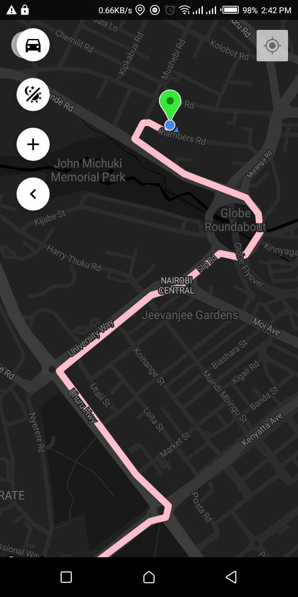

# fueltrack

# Before using:
1. Generate your google maps API key.
2. Under AndroidManifest.xml, add your key.

# Usage instructions:

1. git clone https://github.com/kitavidavis/fueltrack
2. cd fueltrack && npm install
3. npm run android

# screenshots
 
